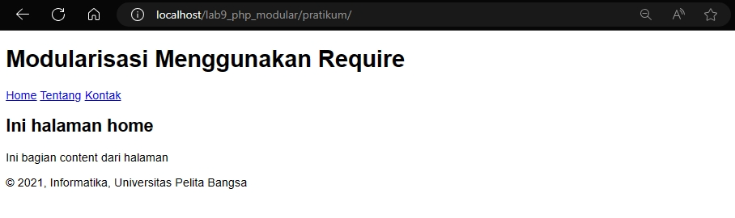
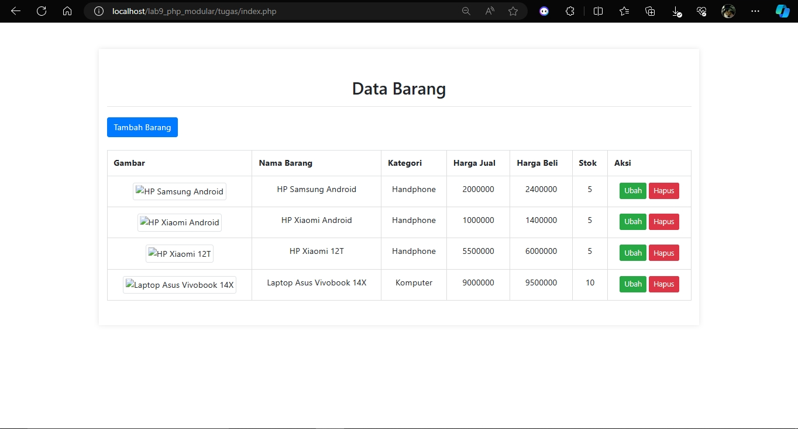
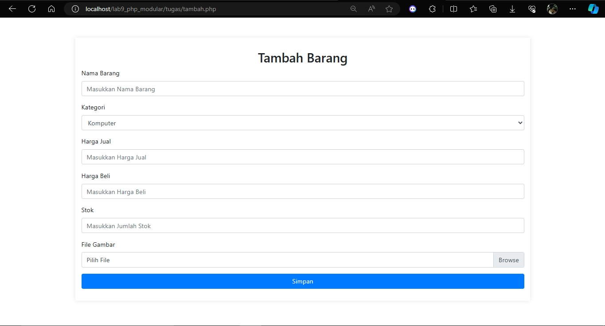
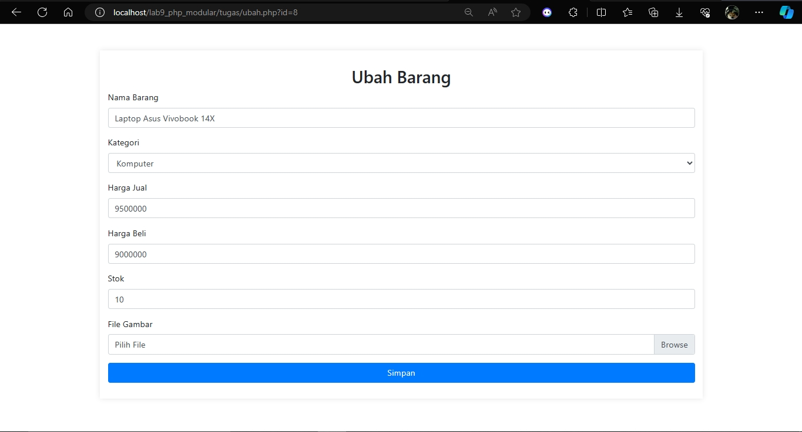

<table>
  <tr>
    <td>Nama</td>
    <td>Rafif Isdarufa Athallah</td>
  </tr>
  <tr>
    <td>NIM</td>
    <td>312210299</td>
  </tr>
  <tr>
    <td>Kelas</td>
    <td>TI.22.A3</td>
  </tr>
</table>

---

## Pratikum 9 : PHP Modular

### Pengertian

- PHP modular adalah konsep dalam pengembangan aplikasi web dengan PHP di mana kode program dibagi menjadi beberapa modul atau bagian terpisah yang dapat digunakan kembali. Setiap modul dapat berisi fungsi, kelas, atau bahkan sub-modul lainnya. Dengan menggunakan pendekatan modular, pengembang dapat membangun aplikasi yang lebih mudah dipelihara, dimodifikasi, dan ditingkatkan. Selain itu, pengembang juga dapat menghindari duplikasi kode dan meningkatkan efisiensi waktu pengembangan.

- `include` dan `require` adalah perintah dalam PHP yang digunakan untuk memasukkan kode dari file eksternal ke dalam file PHP saat ini.

- Perintah `include` digunakan untuk memasukkan dan menjalankan kode dari file eksternal ke dalam file PHP saat ini. Jika file yang di-`include` tidak ditemukan, PHP akan mengeluarkan peringatan namun tetap melanjutkan eksekusi program.

- Sementara itu, perintah `require` juga digunakan untuk memasukkan dan menjalankan kode dari file eksternal ke dalam file PHP saat ini. Namun, perbedaannya dengan `include` adalah jika file yang di-`require` tidak ditemukan, PHP akan mengeluarkan kesalahan fatal dan menghentikan eksekusi program.

---

### Instruksi Praktikum
- Persiapkan text editor misalnya VSCode.
- Buat folder baru dengan nama **lab9_php_modular** pada *htdocs*

---

### Langkah-Langkah Pratikum

- Buat file baru dengan nama *header.php*, *footer.php*, *home.php*, *about.php*

```html
<!-- header.php -->

<!DOCTYPE html>
<html lang="en">
<head>
    <meta charset="UTF-8">
    <title>Contoh Modularisasi</title>
    <link href="style.css" rel="stylesheet" type="text/stylesheet"
    media="screen" />
</head>
<body>
    <div class="container">
        <header>
            <h1>Modularisasi Menggunakan Require</h1>
        </header>
    <nav>
        <a href="home.php">Home</a>
        <a href="about.php">Tentang</a>
        <a href="kontak.php">Kontak</a>
    </nav>
```
```html
<!-- footer.php -->

        <footer>
            <p>&copy; 2021, Informatika, Universitas Pelita Bangsa</p>
        </footer>
    </div>
</body>
</html>
```

```php
// home.php 

<?php require('header.php'); ?>
<div class="content">
    <h2>Ini Halaman Home</h2>
    <p>Ini adalah bagian content dari halaman.</p>
</div>
<?php require('footer.php'); ?>
```

```php
// about.php

<?php require('header.php'); ?>
<div class="content">
    <h2>Ini Halaman About</h2>
    <p>Ini adalah bagian content dari halaman.</p>
</div>
<?php require('footer.php'); ?>
```



---

### Pertanyaan dan Tugas

#### Implementasikan konsep modularisasi pada kode program Praktikum 8 tentang database, sehingga setiap halamannya memiliki template tampilan yang sama.





---

### Sekian, terimakasih.